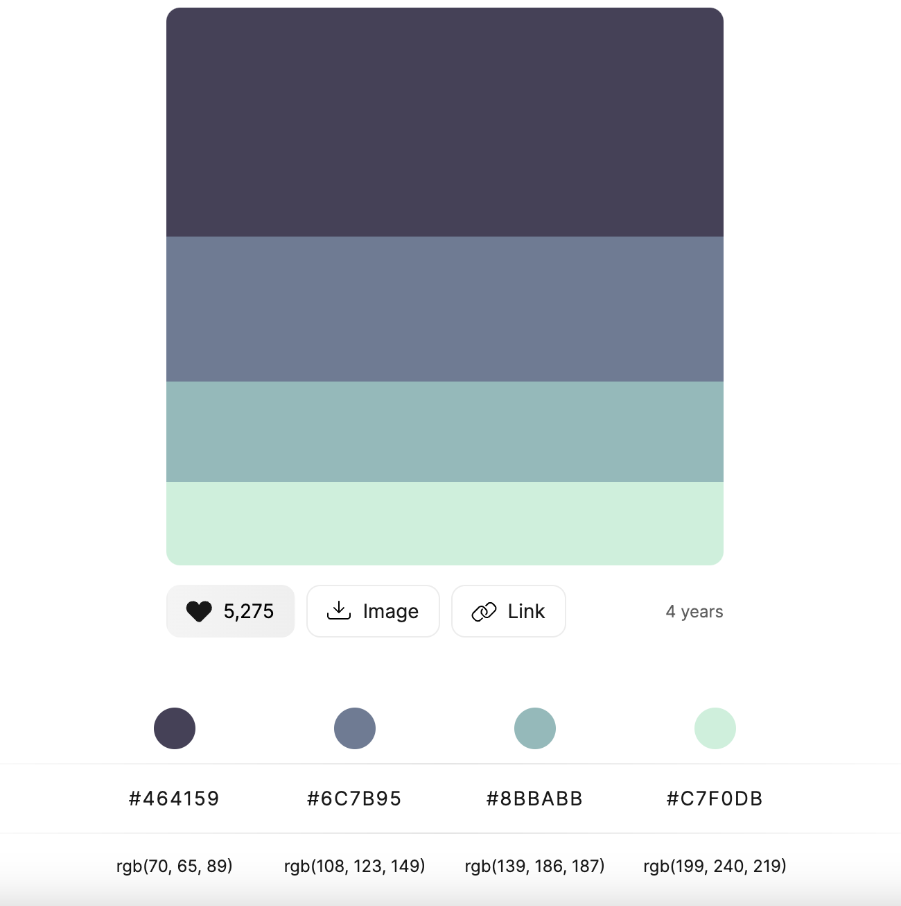
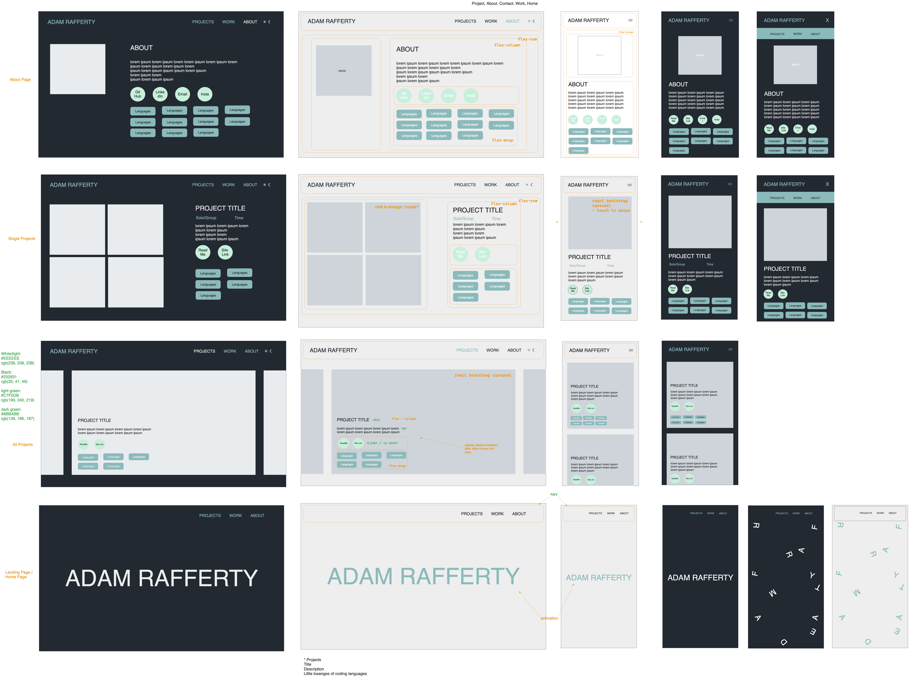
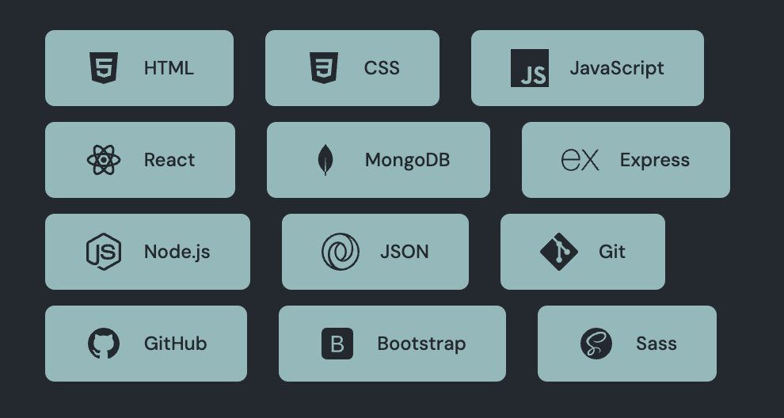

# Portfolio - Adam Rafferty Web Design


## Description

This is my updated portfolio showcasing my coding projects, mainly using React, and React Bootstrap to show a carousel of all projects with access to more detailed pages on each project. 


## Deployment link

[Adam Rafferty Web Design - Live Link](www.adamraffertywebdesign.com)


## Getting Started/Code Installation

#### Packages to download
```
Vite, react, react-dom, react-bootstrap, react-icons, react-router-dom, sass. 
```


## Timeframe & Working Team (Solo)

Solo project - 1 week
This project was started during my course so I would code here and there in down time. On completing the course I spent 3 full days to get it completed.


## Technologies Used

HTML, CSS, JavaScript, Sass, Node.js, Vite, React, JSON, React Bootstrap, Git, GitHub, Chrome DevTools.

Excalidraw, Canva, VS Code.


## Planning

#### Ideas
I had created a portfolio in the past but with a limited skill set at that point it was never finished to the degree I had envisioned. Now I have finished my course I can add in more functionality and do it with a lot more ease. 
I knew I wanted to have a fun animation for users to first see on entering the site and had an idea and a rough plan for how to accomplish it too. 
I also still liked the idea of a carousel to scroll through all of the projects like I had attempted in my previous project, but I also wanted users to have the ability to read more information and see more images of each one. 

#### Design
I made sure to do research on what to include on a portfolio site, and I also spent time on different developers and designer’s portfolio sites to get an idea of colour schemes and layouts that I liked. I used [colorhunt.co](https://colorhunt.co/) to get some ideas for colour schemes and tried a few different fonts to see what could go well with the animation I wanted to build.




#### Wireframing
Now I had the colour scheme, it helped me get a better idea of how to use these to highlight certain aspects of the site, call to action buttons, and also how I would reverse the colours for a light and dark mode. I made sure to use this opportunity to get a good idea of how the user would work their way through the site, and also how the site would switch between a mobile and a desktop view so that I could better plan how I would group elements for styling. 




## Build/Code Process

#### Christmas Break 2023 - 1 day total broken up across a week. 
Beginning a little back to front, I had an idea for an animation and wanted to see if this was something I could create, so this was built in silo (more on this in Wins). 
Once this was successful, I went into more detail with my wireframing, colour schemes and font choice research.
I went on to create the base structure of the site, get dependencies added and get pages stubbed up for routing. 
To bring in the animation I needed to make slight adjustments so that it would fit into the site as it had been built in simple JavaScript. 
I added in some styling, both for the font to ensure the animation worked with the styling, and for the colour scheme to get ready for dark/light mode functionality. 

#### Free Day during studies
I built the React Bootstrap Navbar and then set about creating the light/dark mode component for users to choose their preference with a React Bootstrap Toggle button. I also set up the About Me page with links and styled React Bootstrap Badges to display coding languages in my skill set.  

#### Wednesday 24th - Half Day
I added in an array of objects of project information to begin working with, with all the key value pairs I was going to need. I was then able to set up and style the carousel which would make up the main project page for users to look through, and was able to map in the relevant key value pairs I wanted to display as a preview. The rest of the information would be for the individual project pages.

#### Thursday 25th
I structured the individual project pages and mapped in the data to display. I had an issue with everything but the images displaying, after breaking down the issue piece by piece I found there was a missing slash at the start of the relative path URL. I also added in the styling for this page as the project information took a large chunk of its styling from the layout of the About Me page. This meant styling for mobile view was also quick and easy. 
From here I explored adding in a modal to enlarge the project images in the individual project view. As I had already added in a carousel on the main page, this was fairly straightforward to also add into the modal so that users can cycle through the images of each project, instead of having to click on each one to see a separate modal.

```javascript
<Modal data-bs-theme="dark" show={lgShow} onHide={() => setLgShow(false)} centered>
  <Modal.Header closeButton>{title}</Modal.Header>
  <Modal.Body>
    <Carousel touch={true} wrap={true} className='modal-carousel' prevIcon={prevIcon} nextIcon={nextIcon}>
      {projectImages.map((projectImage) => {
        return (
          <Carousel.Item key={'carousel'+title+projectImage}>
            <div className='modal-carousel-img' style={{ backgroundImage: `url(${projectImage})` }}></div>
          </Carousel.Item>
        )
      })}
    </Carousel>
  </Modal.Body>
</Modal>
```

#### Friday 26th 
Added some styling updates to the About Me page, mainly to add in SVG logos for each skill set in the React Bootstrap Buttons.


 
I completed the styling for the modal box containing the project images carousel as it wasn’t centred, the Bootstrap dark mode wasn’t displaying the close button correctly and the image sizing was overlapping. I also added in a Footer with links and styling. 

#### Monday 29th
There are two projects where the live link is no longer accessible due to changes in API and changes in the clients hosting site. So I needed to add in a ternary so that if there is no `href` link available then the button should not display.

```javascript
{liveLink !== '' ?
  <a className='social-icons' href={liveLink} target="_blank" rel="noopener noreferrer" >
    <svg xmlns="http://www.w3.org/2000/svg" width="2.5em" height="2.5em" fill="currentColor" className="social-img bi bi-box-arrow-up-right" viewBox="0 0 16 16">
      <path fillRule="evenodd" d="M8.636 3.5a.5.5 0 0 0-.5-.5H1.5A1.5 1.5 0 0 0 0 4.5v10A1.5 1.5 0 0 0 1.5 16h10a1.5 1.5 0 0 0 1.5-1.5V7.864a.5.5 0 0 0-1 0V14.5a.5.5 0 0 1-.5.5h-10a.5.5 0 0 1-.5-.5v-10a.5.5 0 0 1 .5-.5h6.636a.5.5 0 0 0 .5-.5"/>
      <path fillRule="evenodd" d="M16 .5a.5.5 0 0 0-.5-.5h-5a.5.5 0 0 0 0 1h3.793L6.146 9.146a.5.5 0 1 0 .708.708L15 1.707V5.5a.5.5 0 0 0 1 0z"/>
    </svg>
  </a>
  :
  ''
}
```

I was unable to work with the React Bootstrap Navbar to fix a close issue in mobile view (added to Bugs below). I added in the dates to the projects to give a better idea on timeline, added a tab menu to the About Me page, and made the carousel and mobile view of All Projects more obvious so that users know they can see more information with a click. 

There were also ternary operators for the Navbar and the Footer. These used the React Router Dom hook `useLocation()` to determine when the user was on the landing page. When the user is, then the Navbar brand changes from my name to say ‘Web Developer’ as my name is already in the large animation. The footer also doesn’t appear on the landing page with a similar ternary.

```javascript
const location = useLocation()

  return (
    <Navbar collapseOnSelect expand='md' className='bg-body-tertiary' id='navbar-main-page'>
      {location.pathname === '/' ?
        <Navbar.Brand><Link className='nav-btn-brand' to='/'>Web Developer</Link></Navbar.Brand>
        :
        <Navbar.Brand><Link className='nav-btn-brand' to='/'>Adam Rafferty</Link></Navbar.Brand>
      }
```


## Challenges

#### Dark/Light Mode

Both a challenge and a win, I wanted to have an option to switch modes as a personal challenge, but also after having gone through a course with developers and soon-to-be developers the overarching complaint of most sites was the lack of a dark mode option. I decided this was what I would have as default but there would be the option of a light mode. 

I began by setting up a basic Toggle Button using React Bootstrap to toggle between the two modes. I tried a couple of methods but the one that stuck involved using `var(--)` and then setting an attribute to the document element to switch the theme. I had my colour scheme set up so it was a case of making up the colour options for the standard styling in `:root` and then what the colour would switch to in the `[data theme = “light”]` for example (and self explanatory): 

```
:root {
  --black-to-white: #232931;
}
[data-theme="light"] {
  --black-to-white: #EEEEEE;
}
```

I then set up my icons to show the user which option they were on and the one they could switch to.

```javascript
export default function DarkMode() {
  const [radioValue, setRadioValue] = useState('2')
  const radios = [
    { name:
      <svg xmlns='http://www.w3.org/2000/svg' width='1em' height='1em' fill='currentColor' className='bi bi-sun-fill' viewBox='0 0 16 16'>
        <path d='M8 12a4 4 0 1 0 0-8 4 4 0 0 0 0 8M8 0a.5.5 0 0 1 .5.5v2a.5.5 0 0 1-1 0v-2A.5.5 0 0 1 8 0m0 13a.5.5 0 0 1 .5.5v2a.5.5 0 0 1-1 0v-2A.5.5 0 0 1 8 13m8-5a.5.5 0 0 1-.5.5h-2a.5.5 0 0 1 0-1h2a.5.5 0 0 1 .5.5M3 8a.5.5 0 0 1-.5.5h-2a.5.5 0 0 1 0-1h2A.5.5 0 0 1 3 8m10.657-5.657a.5.5 0 0 1 0 .707l-1.414 1.415a.5.5 0 1 1-.707-.708l1.414-1.414a.5.5 0 0 1 .707 0m-9.193 9.193a.5.5 0 0 1 0 .707L3.05 13.657a.5.5 0 0 1-.707-.707l1.414-1.414a.5.5 0 0 1 .707 0m9.193 2.121a.5.5 0 0 1-.707 0l-1.414-1.414a.5.5 0 0 1 .707-.707l1.414 1.414a.5.5 0 0 1 0 .707M4.464 4.465a.5.5 0 0 1-.707 0L2.343 3.05a.5.5 0 1 1 .707-.707l1.414 1.414a.5.5 0 0 1 0 .708'/>
      </svg>, value: '1' },
    { name:
      <svg xmlns='http://www.w3.org/2000/svg' width='1em' height='1em' fill='currentColor' className='bi bi-moon-fill' viewBox='0 0 16 16'>
        <path d='M6 .278a.77.77 0 0 1 .08.858 7.2 7.2 0 0 0-.878 3.46c0 4.021 3.278 7.277 7.318 7.277q.792-.001 1.533-.16a.79.79 0 0 1 .81.316.73.73 0 0 1-.031.893A8.35 8.35 0 0 1 8.344 16C3.734 16 0 12.286 0 7.71 0 4.266 2.114 1.312 5.124.06A.75.75 0 0 1 6 .278'/>
      </svg>, value: '2' },
  ]


  if (radioValue == 1) {
    document.documentElement.setAttribute('data-theme', 'light')
    } else if (radioValue == 2) {
    document.documentElement.setAttribute('data-theme', 'dark')
    }
    return (
    <ButtonGroup>
      {radios.map((radio, idx) => (
        <ToggleButton
          key={idx}
          id={`radio-${idx}`}
          type="radio"
          variant={idx % 2 ? 'outline-dark' : 'outline-light'}
          name="radio"
          value={radio.value}
          checked={radioValue === radio.value}
          onChange={(e) => setRadioValue(e.currentTarget.value)}
        >
          {radio.name}
        </ToggleButton>
      ))}
    </ButtonGroup>
  )
}
```

#### SVG colours
A small win but something I’d had to workaround previously, when adding fill colours and path strokes I’d previously used RGB colours as that seemed to be accepted, but I have now found that `%23` will allow HEX colours. 

```
path stroke='%238bbabb'
```


## Wins

#### Landing Page Animation

As above, both a win and a challenge, this is pretty much where I began with my new portfolio as I had been so impressed with other developers' pages that I wanted an animation for users to see on arrival. I knew roughly how I wanted it to look and act, and I had a pretty good idea of the pieces that would need to go together to accomplish it. 

My thoughts were:
* I need to assign each letter a starting direction, possibly using a randomised x and y axis value.
* I could possibly have a `setInterval()` to keep each element going in their direction in increments.
* I want to add a slow spin to each element too.
* When the user does a `mouseOver()` the letters snap back to their starting position.

Some parts of this were exactly what I needed to do, some of these ideas were more complex than they eventually needed to be.

I needed to get access to the letters first, these were individually in an array, and then with a `forEach()` a div was created for each one, named, and the letter was added to the `innerText`.

```javascript
export default function LandingLogo() {
  const letterBoxes = []
  const boxStartPoints = []


  useEffect(() => {
    async function getName() {
      const titleContainer = document.querySelector('#title')
      const myName = ['A', 'd', 'a', 'm', ' ', 'R', 'a', 'f', 'f', 'e', 'r', 't', 'y']
      myName.forEach(letter => {
        const letterDiv = document.createElement('div')
        letterDiv.className = 'indLetterDiv'
        letterDiv.innerText = letter.toUpperCase()
        titleContainer.appendChild(letterDiv)
        letterBoxes.push(letterDiv)
      })
      startPoint()
    }
    getName()
  }, [])
```

I had the idea for the random paths of the letters but I needed a launch point first. The `startPoint()` function takes the offset value of the letter divs and calculates the location on the page that the animation would begin from and returns this as a percentage. This would also help us return them to their original starting points later so I came back to this and these were made into objects and added to an array.

```javascript
async function startPoint() {
  letterBoxes.forEach(box => {
    // * takes the offset value and turn it into a percentage
    // * % = small number divided  by large number * 100
    // * (offset position / window size) * 100
    box.style.top = ((box.offsetTop / window.innerHeight) * 100) + '%'
    box.style.left = ((box.offsetLeft / window.innerWidth) * 100) + '%'
    boxStartPoints.push({ 'box.style.top': box.style.top, 'box.style.left': box.style.left })     
    // * starts process again
    box.addEventListener('mouseover', assignOGPoint)
  })
}
startPoint()
```

The randomised letter paths were the fun part. This function sets a randomised absolute destination as a percentage on the page and then randomises the amount of degrees each letter should turn as it travels, and also randomises if this will be a clockwise or anticlockwise spin. 

```javascript
function releaseLetters() {
  letterBoxes.forEach(box => {
    // * gets a new position to move to
    box.style.position = 'absolute'
    box.style.top = Math.floor(Math.random() * 100) + '%'
    box.style.left = Math.floor(Math.random() * 100) + '%'
    // * sets a random amount of degrees to spin, and whether plus or minus (clockwise or anti-clockwise)
    const spin = Math.floor(Math.random() * 360) + 'deg'
    const getPlusOrMinus = Math.random() < 0.5
    const plusOrMinus = getPlusOrMinus ? '-' : ''
    box.style.transform = `rotate(${plusOrMinus}${spin})`
    box.style.transition = '10s cubic-bezier(0.45, 0.13, 0.38, 0.41)'
  })
}
setTimeout(releaseLetters, 3 * 1000)
```

The issue was then getting them back to their original starting points if the user interacted with any of them. But we had these starting points in an array so we assigned these values back to each letter, and made sure that the letters rotated back to 0 degrees.

```javascript
function assignOGPoint() {
  for (let i = 0; i < letterBoxes.length; i++) {
    // * assigns original position from saved array values
    letterBoxes[i].style.top = Object.entries(boxStartPoints[i])[0][1]
    letterBoxes[i].style.left = Object.entries(boxStartPoints[i])[1][1]
    // * letters to original rotation
    letterBoxes[i].style.transform = 'rotate(0)'
    letterBoxes[i].style.transition = '2s cubic-bezier(0.28, 0.08, 0.81,-0.11)'
    setTimeout(releaseLetters, 15 * 1000)
  }
 }
```


## Key Learnings/Takeaways

The wireframing I did for this project set me up to go into my project 4 of the Software Engineering course with a good process, which was key. It meant I set time aside to focus on how things were going to look, work and flow for the user. It also meant I could plan ahead of time how I was going to set sections of the site up so they would be easier to style to go from desktop to mobile. Making sure I had ideas even for the colour scheme and font meant that I didn’t have to think about any of this mid project and then not put enough thought into it.


## Bugs

#### React Bootstrap Navbar
The React Bootstrap Navbar doesn’t close on clicking a link or elsewhere on the page, only when you click on its Toggle button. I have researched through Bootstrap documentation, Stack Overflow, and various other sites and tried different fixes but can’t get it to work with a Bootstrap solution so far. I wanted to use a Bootstrap solution as when I created a workaround to close on click, it overrode the inbuilt animation for menu close, and snapped shut which wasn't as pleasing a user experience.


## Future Improvements

* Add in client quotes from projects I have completed.
* Navbar mobile view to close when a link is clicked, or a user clicks elsewhere on the page.


